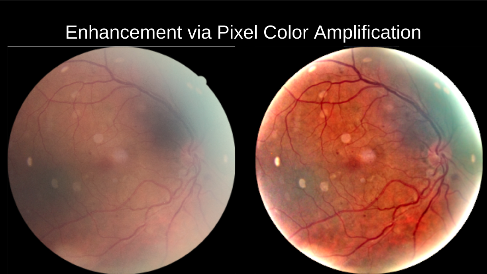
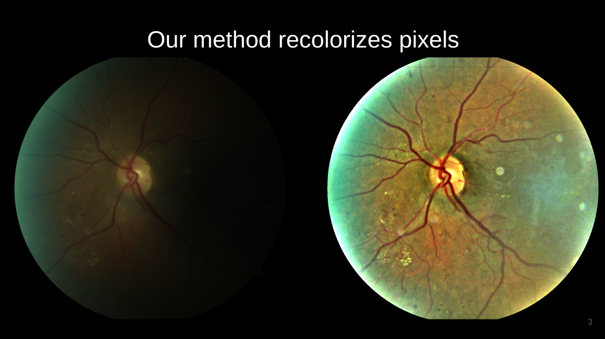

# IETK-Ret - Image Enhancement Toolkit for Retinal Fundus Images

This repository contains a collection of enhancement methods useful for
retinal fundus images, with emphasis on **Pixel Color Amplification**.  
These methods are very useful as a **pre-processing step to fundus image
analysis and machine learning**.  They have applicability to a wide
variety of image domains, but we focus on retinal fundus images.

I would be happy to link to your paper in the "papers" section if you
use this code or method.  Please cite or acknowledge the below paper if you use
the code or method.  Thank you!

> A. Gaudio, A. Smailagic, A. Campilho, “Enhancement of Retinal Fundus Images via Pixel Color Amplification,” In: Karray F., Campilho A., Wang Z. (eds) Image Analysis and Recognition. ICIAR 2020. Lecture Notes in Computer Science, vol 11663. Springer, Cham (accepted)


# Some Example Results





# Papers:

- [./iciar2020/](./iciar2020)  -  Code, slides and paper for the **Pixel Color Amplification paper** from ICIAR 2020.

<!-- It also contains the code used for the Pixel Color Amplification paper: -->
<!-- todo -->
<!-- [code](./iciar2020)  [paper: Pixel Color Amplification](TODO) -->

# Code:

- `ietk.util` - methods to separate the fundus from the black background,
as well as crop the image to minimize background.
- `ietk.methods` - a set of enhancement methods, mostly based on pixel
color amplification for brightening, darkening and sharpening.
- `ietk.data` - access to the images in the IDRiD dataset for R&D
  (assuming you already downloaded the dataset)


# Usage

```
pip install ietk-ret
```


### Example usage:
```
from matplotlib import pyplot as plt
from ietk import methods
from ietk import util
from ietk.data import IDRiD

# load a fundus image, normalized into 0-1 range (not 0-255)
# such as one from the IDRiD dataset  (assuming you already have it on disk)
dset = IDRiD('./data/IDRiD_segmentation')
img_id, img, labels = dset.sample()
print("using image", img_id)


# crop fundus image and get a focus region  (a very useful function!)
I = img.copy()
I, fg = util.center_crop_and_get_foreground_mask(I)

# enhance the image with an enhancement method from the ICIAR 2020 paper
# (any combination of letters A,B,C,D,W,X,Y,Z and sA,sB,sC,... are supported)
enhanced_img = methods.brighten_darken(I, 'A+B+X', focus_region=fg)
enhanced_img2 = methods.sharpen(enhanced_img, bg=~fg)

# plot results
f, (ax1, ax2, ax3) = plt.subplots(1, 3)
ax1.imshow(img)
ax2.imshow(enhanced_img)
ax3.imshow(enhanced_img2)
f.tight_layout()
```

# Disclaimer

This code, including the API and methods, may not be backwards
compatible between releases.  If you use it, fix the version, git tag or
git commit used in your requirements.txt file.

I am not responsible or liable for your use of this code or methods.
Please *carefully* verify and ensure safety of its use in any production or
decision-making or clinical or other contexts.
